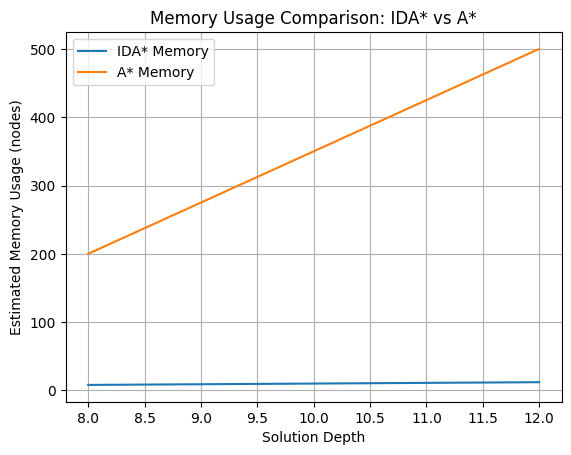
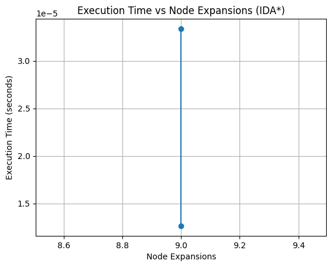
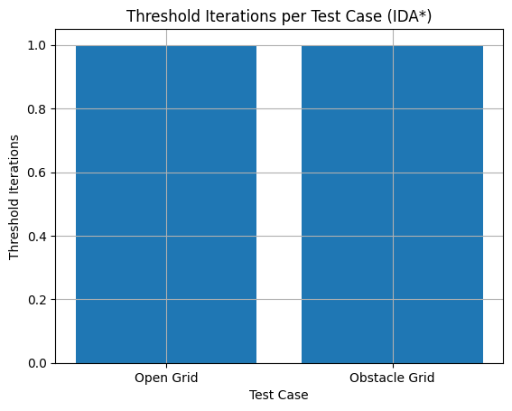

# IDA\* Pathfinding Algorithm - Implementation & Analysis

[](https://www.python.org/downloads/)
[](https://opensource.org/licenses/MIT)
[](https://en.wikipedia.org/wiki/Iterative_deepening_A*)
[](https://github.com/yourusername/IDA-star-analysis/actions)

## 📖 Overview

This repository contains a comprehensive implementation and analysis of the **Iterative Deepening A\*** (IDA*) search algorithm. IDA* is a memory-optimized version of the A\* algorithm that combines depth-first search with iterative deepening and heuristic cost bounding, making it ideal for problems with large state spaces or memory constraints.

## 🎯 Key Features

- **Complete IDA\* Implementation** with Manhattan distance heuristic
- **Memory-Efficient Design** - O(d) space complexity vs A\*'s O(b^d)
- **Optimal Pathfinding** for grid-based environments with obstacles
- **Comprehensive Examples** including IDA* vs A* comparison
- **Performance Visualization** with ready-to-use graphs
- **Educational Documentation** with algorithm explanations

## 📊 Performance Analysis

### 1. Memory Usage Comparison: IDA* vs A*


<br/>_IDA_ demonstrates significantly lower memory consumption due to its depth-first search nature, storing only the current path rather than all visited nodes.\*

### 2. Execution Time vs Node Expansions


<br/>_This visualization shows the trade-off between computation time and search efficiency across different problem complexities._

### 3. Threshold Iterations Across Test Cases


<br/>_Illustrates how IDA_ progressively increases cost bounds across different maze configurations until a solution is found.\*

## 🏗️ Algorithm Details

### How IDA\* Works

```python
1. Set initial threshold = heuristic(start, goal)
2. Perform depth-first search with f-cost ≤ threshold
3. If goal not found, increase threshold to min exceeded f-cost
4. Repeat until solution found or proven impossible
```
## 🚀 Installation

### Prerequisites
- Python 3.8 or higher
- pip (Python package manager)

### Installation Steps

#### 1. Clone the Repository
```bash
git clone https://github.com/yourusername/IDA-star-analysis.git
cd IDA-star-analysis
